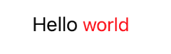
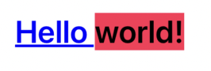

# SmartString
[](https://swift.org)


Powerful and small library written in **Swift** that will allow you to create complex attributed strings. Easily chain Strings + SmartStrings to create the perfect style, and register substrings Tap Getures handlers.

## Features

- [x] Powerful and intuitive APIs
- [x] Easily chain SmartString + Strings 
- [x] XML Tagged string styles
- [x] Tap Gestures handlers directly on substrings
- [x] Create and store predefined & reusable Styles
- [x] Ideal for anyone who builds UI from code

## Projects using SmartString
- [YourVPN](https://yourvpn.world/)

## Installation

### Swift Package Manager
The [Swift Package Manager](https://swift.org/package-manager/) is a tool for automating the distribution of Swift code and is integrated into the `swift` compiler.

In Xcode 11+ select File > Packages > Add Package Dependency > Enter this project's URL:
    
    https://github.com/vetrek/SmartString.git


### CocoaPods

```ruby
pod 'SmartString'
```

## Example

* ### Usage
```swift
let smartString = "Hello world!"
    .font(.boldSystemFont(ofSize: 30))
    .color(.blue)
    .underline()
    .shadow(SmartShadow())
    .onTap { string in
        print(string) // This will print "Hello world!"
    }

label.smartString = smartString

// Using Closures

let smartString = "Hello world!"
    .font { .boldSystemFont(ofSize: 30) }
    .color { .blue }
    .shadow { .default }
    .underline()

label.smartString = smartString
```

Result


* ### Predefined Style
```swift
let style = SmartStringStyle { style in
    style.font = .systemFont(ofSize: 21)
    style.color = .red
    style.underlined = true
    style.shadow = .default
    style.onTap = { string in
        print(string)
    }
}

label.smartString = "Hello world!".style(style)
```

Result


* ### String + SmartString interpolation
```swift
label.smartString = "Hello" + " world!".font(.systemFont(ofSize: 24)).color(.purple)
```

Result


* ### String + SmartString interpolation using predefined Styles
```swift
let style1 = SmartStringStyle { style in
    style.color = .green
    style.font = .boldSystemFont(ofSize: 30)
    style.shadow = .default
}
        
label.smartString = "Hello" + " world!".style(style1)
```

Result


* ### Label substring Tap Handlers

```swift
let smartString = "Hello "
    .font { .systemFont(ofSize: 18) }
    .onTap { string in
        print(string) // This will print "Hello " when tapping the substring "Hello " within the label
    }
+ "world"
    .color(.red)
    .bold()
    .onTap { string in
        print(string) // This will print "world" when tapping the substring "world" within the label
    }
+ "!"
    
label.smartString = smartString
```

Result



* ### Define style using XML Tags

#### Styles
```swift

//  XMLStringStyles.swift 
enum XMLStringStyles: String, CaseIterable, SmartStringStylable {
    case primary
    case secondary

    var style: SmartStringStyle {
        switch self {
        case .primary:
            return SmartStringStyle { style in
                style.font = .boldSystemFont(ofSize: 24)
                style.color = .blue
                style.link = URL(string: "https://google.com")
            }
        case .secondary:
            return SmartStringStyle { style in
                style.font = .boldSystemFont(ofSize: 24)
                style.color = .black
                style.backgroundColor = .systemPink
            }
        }
    }
    
    /// Associate tags with styles. You should call this function when the app starts running
    static func setXmlSmartStringStyles() {
        XMLStringStyles.allCases.forEach {
            SmartStringXMLStyles.styles[$0.rawValue] = $0.style
        }
    }

}

```

#### Associate styles to tags after application launch
```swift
//  AppDelegate.swift File
func application(_ application: UIApplication, didFinishLaunchingWithOptions launchOptions: [UIApplication.LaunchOptionsKey: Any]?) -> Bool {
    // Override point for customization after application launch.
    
    // Register styles
    XMLStringStyles.setXmlSmartStringStyles()
    
    return true
}
```

#### Usage
```swift
// ViewController.Swift File

// Option 1
label.smartString = "<primary>Hello </primary><secondary>world!</secondary>".smartStringXML

// Option 2, which uses a **tag** method to apply tags
let xmlString = "Hello ".tag(XMLStringStyles.primary) + "world!".tag(XMLStringStyles.secondary)
label.smartString = xmlString.smartStringXML

// Option 3, wrap **tag** method in a string extension to have an even cleaner coder
extension String {
    func tag(with style: XMLStringStyles) -> String {
        tag(style)
    }
}

let xmlString = "Hello ".tag(with: .primary) + "world!".tag(with: .secondary)
label.smartString = xmlString.smartStringXML

```

Result



## Author

SmartString is maintained by Valerio Sebastianelli: [valerio.alsebas@gmail.com](mailto:valerio.alsebas@gmail.com)
