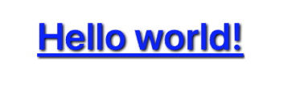
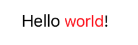

# SmartString

Powerful and small library written in **Swift** that will allow you to create complex attributed strings. Easily chain Strings + SmartStrings to create the perfect style, and register substrings Tap Getures handlers.

## Features

- [x] Powerful and intuitive APIs
- [x] Easily chain SmartString + Strings 
- [x] XML Tagged string styles
- [x] Tap Gestures handlers directly on substrings
- [x] Create and store predefined & reusable Styles
- [x] Ideal for anyone who builds UI from code

## Example

* Basic
```swift
let smartString = "Hello world!"
    .font(.boldSystemFont(ofSize: 30))
    .color(.blue)
    .underline()
    .shadow(SmartShadow()

label.smartString = smartString

// Using Closures

let smartString = "Hello world!"
    .font { .boldSystemFont(ofSize: 30) }
    .color { .blue }
    .shadow { .default }
    .underline()

label.smartString = smartString
```

Result



### Predefined Style
```swift
let style = SmartStringStyle(
    color: .blue,
    font: .boldSystemFont(ofSize: 30),
    shadow: SmartShadow(
    offset: CGSize(width: 2, height: 2),
    radius: 2,
    color: .red
)

label.smartString = "Hello world!".style(style)
```

Result


### String + SmartString interpolation
```swift
let smartString = "Hello"
    .font(.boldSystemFont(ofSize: 30))
    .color(.green)
    .underline()
    .italic()
    .shadow(.default)
+ " world!"
    .font(.systemFont(ofSize: 24))
    .color(.purple)
    
label.smartString = smartString
```

Result


### String + SmartString interpolation using predefined Styles
```swift
let style1 = SmartStringStyle(
    color: .green,
     font: .boldSystemFont(ofSize: 30),
   shadow: .default
)
        
let style2 = SmartStringStyle(
    color: .purple,
     font: .systemFont(ofSize: 24)
)
        
let smartString = "Hello"
    .style(style1)
+ " world!"
    .style(style2)
    
label.smartString = smartString
```

Result


### Label substring Tap Handlers

```swift
let smartString = "Hello "
    .font { .systemFont(ofSize: 18) }
    .onTap { string in
        print(string) // This will print "Hello " when tapping the substring "Hello " within the label
    }
+ "world"
    .color(.red)
    .bold()
    .onTap { string in
        print(string) // This will print "world" when tapping the substring "world" within the label
    }
+ "!"
    
label.smartString = smartString
```

Result



## Author

SmartString is owned and maintained by [Valerio Sebastianelli](mailto:valerio.alsebas@gmail.com)

## License

MIT License

Copyright (c) 2022 Valerio

Permission is hereby granted, free of charge, to any person obtaining a copy
of this software and associated documentation files (the "Software"), to deal
in the Software without restriction, including without limitation the rights
to use, copy, modify, merge, publish, distribute, sublicense, and/or sell
copies of the Software, and to permit persons to whom the Software is
furnished to do so, subject to the following conditions:

The above copyright notice and this permission notice shall be included in all
copies or substantial portions of the Software.

THE SOFTWARE IS PROVIDED "AS IS", WITHOUT WARRANTY OF ANY KIND, EXPRESS OR
IMPLIED, INCLUDING BUT NOT LIMITED TO THE WARRANTIES OF MERCHANTABILITY,
FITNESS FOR A PARTICULAR PURPOSE AND NONINFRINGEMENT. IN NO EVENT SHALL THE
AUTHORS OR COPYRIGHT HOLDERS BE LIABLE FOR ANY CLAIM, DAMAGES OR OTHER
LIABILITY, WHETHER IN AN ACTION OF CONTRACT, TORT OR OTHERWISE, ARISING FROM,
OUT OF OR IN CONNECTION WITH THE SOFTWARE OR THE USE OR OTHER DEALINGS IN THE
SOFTWARE.

